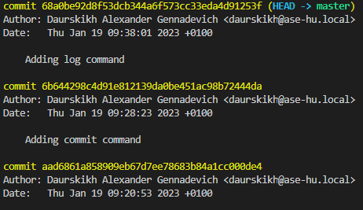
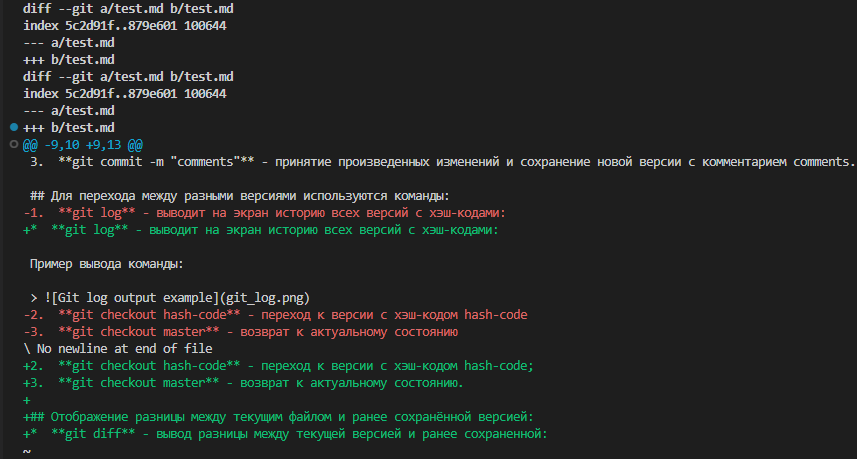

# Инструкция по работе с Git

## Для создания репозитория используется команда:  
**git init** - инициализация пустого репозитория в текущей папке.

## Для сохранения файла в репозиторий используются команды:  
1.  **git add filename** - сохранение файла с именем filename;
2.  **git add .** - сохранение ВСЕХ файлов;
3.  **git commit -m "comments"** - принятие произведенных изменений и сохранение новой версии с комментарием comments.

## Для перехода между разными версиями используются команды:
*  **git log** - выводит на экран историю всех версий с хэш-кодами:

Пример вывода команды:

> 
2.  **git checkout hash-code** - переход к версии с хэш-кодом hash-code;
3.  **git checkout master** - возврат к актуальному состоянию.

## Отображение разницы между текущим файлом и ранее сохранённой версией:
*  **git diff** - вывод разницы между текущей версией и ранее сохраненной:

Пример вывода команды:

> 

## Команды работы с разными ветками 
* **git branch** - отображение всех веток, текущая ветка выделена зелёным цветом и звёздочкой;
* **git branch new_branch** - создание новой ветки с названием *new_branch*;
* **git checkout branch_name** - переход к ранее созданной ветке с именем *branch_name*;
* **git branch -d branch_name** - удаление ветки с именем *branch_name*;
* **git chechout -b branch_name** - создание новой ветки с именем *branch_name* и одновременный переход в эту ветку;
* **git log --graph** - отоборажает все ветки в наглядном графическом представлении.

## команды для работы с удалёнными репозиториями
* **git clone URL** - клонирование удаленного репозитория, расположенного по адресу *URL*, на локальный компьютер;
* **git push** - отправить локальную версию репозитория на удалённый сервер;
* **git pull** - получить изменения и слить их с локальной версией.
